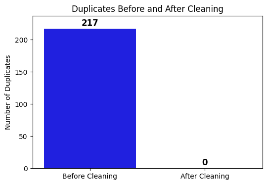
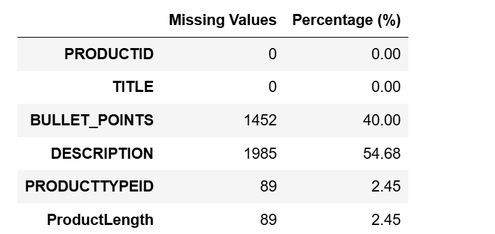
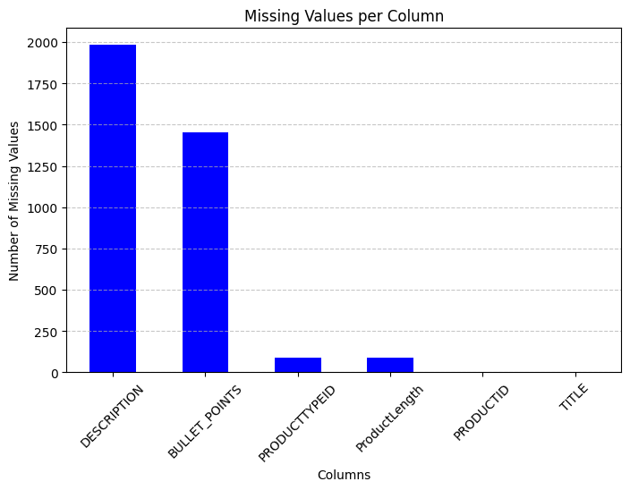
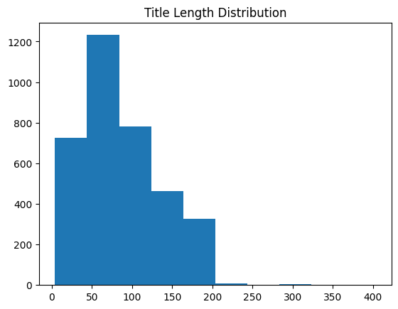
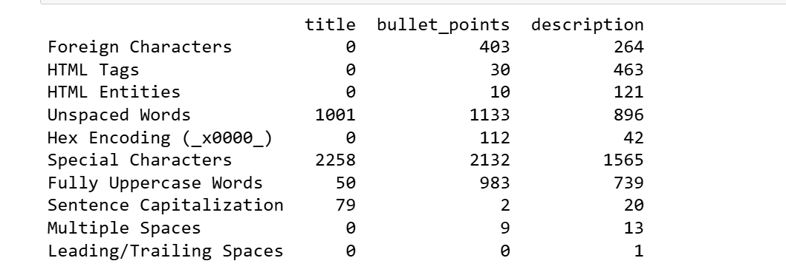
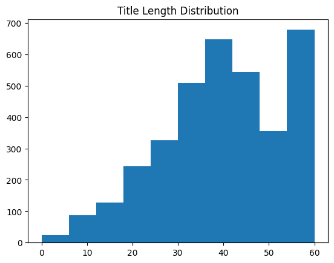

# Optimizing E-Commerce Product Titles for SEO 
 This project demonstrates how to optimize e-commerce product titles for better SEO performance using Python and regular expressions. The solution cleans and refines product titles by removing unnecessary product codes, color adjectives, and filler words while preserving key details such as measurement suffixes to create concise, impactful titles. It showcases practical data wrangling, regex pattern design, and algorithmic problem-solving to improve online visibility and user engagement.

# Product Title Optimization Report

## Table of Contents
- [Introduction](#introduction)
- [Dataset Overview](#dataset-overview)
- [Data Cleaning and Preparation](#data-cleaning-and-preparation)
- [Methodology](#methodology)
- [Challenges Encountered](#challenges-encountered)
- [Key Insights](#key-insights)
- [Recommendations](#recommendations)
- [Conclusion](#conclusion)

## Introduction
Product titles are more than just labels; they’re one of the first things customers see and play a key role in whether they click on your product or move on. In e-commerce, it’s all about striking the right balance between being clear, concise, and SEO-friendly. This project digs into refining product titles using Python and regular expressions (regex) to clean, standardise, and structure them. The aim is to remove the clutter and keep what truly matters, ensuring the titles are easy to read and optimised for search engines.
The Jupyter Notebook detailing the steps of the SEO title optimisation process can be found [here](https://github.com/croweigibson/Optimizing-E-Commerce-Product-Titles-for-SEO-/blob/main/SEO%20Title%20Optimisation.ipynb).


## Dataset Overview
- **Dataset Source:** The dataset used in this project, `productdata.xlsx`, can be accessed [here](https://github.com/croweigibson/Optimizing-E-Commerce-Product-Titles-for-SEO-/blob/main/productdata.xlsx).
- **Total Rows:** 3,847 products (before initial cleaning)
- **Total Columns:** 6
- **Key Features:**
  - `PRODUCTID`: Unique identifier for each product.
  - `TITLE`: Original product title.
  - `BULLET_POINTS`: Product highlights.
  - `DESCRIPTION`: Detailed product description.
  - `PRODUCTTYPEID` and `ProductLength`: Additional numerical attributes.

## Data Cleaning and Preparation
Before optimizing titles, we conducted a thorough data cleaning process to enhance consistency and accuracy.

### 1. **Loading the Dataset**
The dataset was imported using Pandas:
```python
import pandas as pd
product = pd.read_excel("productdata.xlsx")
```
We verified the dataset structure using:
```python
product.shape  # Output: (3,847, 6)
product.info()  # Displays column data types and null counts
```
Observations:
- **3,847 rows and 6 columns** before cleaning.
- **Presence of missing values** in key fields like `BULLET_POINTS` and `DESCRIPTION`.

### 2. **Handling Duplicate Entries**
To ensure unique product records, we identified and removed duplicate rows. 
```# Count duplicates before cleaning
duplicates_before = product.duplicated().sum()

# Remove duplicates in place to ensure product is actually cleaned
product.drop_duplicates(inplace=True)

# Count duplicates after cleaning
duplicates_after = product.duplicated().sum()  # Should be 0

```
- **217 duplicate rows** were removed.

A visualisation of the data before and after cleaning is shown below


### 3. **Handling Missing Values**
A check for missing values revealed:
```python
missing_values = product.isnull().sum()
missing_percent = (product.isnull().sum() / len(product)) * 100

# Creating a DataFrame
missing_df = pd.DataFrame({
    'Missing Values': missing_values,
    'Percentage (%)': missing_percent.round(2)  # Round to 2 decimal places
})

missing_df
```

Findings:
- **41% missing values** in `BULLET_POINTS`
- **56% missing values** in `DESCRIPTION`


Approach:
- Retained records where `TITLE` was present.
- Filled missing values in `BULLET_POINTS` and `DESCRIPTION` with `"No information"`:
```
# Drop rows where numerical columns (float64) have missing values
product.dropna(subset=['PRODUCTTYPEID', 'ProductLength'], inplace=True)

# Replace missing values in categorical columns using .loc[]
product.loc[:, ['BULLET_POINTS', 'DESCRIPTION']] = product[['BULLET_POINTS', 'DESCRIPTION']].fillna("No information")

# Verify changes
print(product.isnull().sum())  # Should return 0 for these columns
```

### 4. **Standardizing Column Names**
For consistency, column names were converted to lowercase with underscores:
```# Convert column names to snake_case
product.columns = product.columns.str.strip().str.lower().str.replace(" ", "_")

print(product.columns)  # Verify changes
```
### 5. **Exploratory Data Analysis**
To understand title distribution, we visualized character lengths:
```# What's the length range of our titles?
product['title'].str.len().describe()

# Maybe plot the distribution to visualize
plt.hist(product['title'].str.len())
plt.title('Title Length Distribution')
plt.show()
```

Observations:
- The histogram shows the distribution of product title lengths, with most titles falling between **50 and 150 characters**. A few outliers extend beyond **250 characters**, but they are rare. Since SEO titles are usually between **50-60 characters**, our new short titles need to fall in that range
- Certain titles contained excessive descriptions, affecting clarity.

### 6. **Identifying Common Text Issues**
Before refining the titles, bullet points, and descriptions, we need to address common text issues such as special characters, HTML tags, and inconsistent capitalization. The following function identifies these issues across the title, bullet_points, and description columns:
```

def check_text_issues(df):
    """
    Identifies common text issues in title, bullet_points, and description columns.
    
    Returns:
    DataFrame: Summary of issues found in each column.
    """
    # Pre-compile regex patterns for performance
    patterns = {
        "Foreign Characters": re.compile(r"[^\x00-\x7F]"),  # Non-ASCII characters
        "HTML Tags": re.compile(r"<[^>]+>"),  # <br>, <p>, etc.
        "HTML Entities": re.compile(r"&\w+;"),  # &nbsp;, &gt;, etc.
        "Unspaced Words": re.compile(r"(?<=\w)(?=[A-Z])"),  # Words without spaces
        "Hex Encoding (_x0000_)": re.compile(r"_x[0-9A-Fa-f]{4}_"),  # Hex-like encoding
        "Special Characters": re.compile(r"[^a-zA-Z0-9\s]"),  # Symbols except spaces
        "Fully Uppercase Words": re.compile(r"\b[A-Z]{2,}\b"),  # Words in ALL CAPS
        "Sentence Capitalization": re.compile(r"^[a-z]"),  # Sentences not starting with a capital letter
        "Multiple Spaces": re.compile(r"\s{2,}"),  # Consecutive spaces
        "Leading/Trailing Spaces": re.compile(r"^\s+|\s+$")  # Spaces at the start or end
    }

    columns = ["title", "bullet_points", "description"]
    results = {col: {} for col in columns}

    for col in columns:
        if col in df.columns:
            for issue, pattern in patterns.items():
                results[col][issue] = df[col].str.contains(pattern, regex=True, na=False).sum()

    return pd.DataFrame(results)

# Run check on the product dataframe
text_issues_report = check_text_issues(product)

# Display results
print(text_issues_report)
```
This function checks for several issues, such as:

- Non-ASCII characters
- HTML tags and entities
- Unspaced words
- Special characters and capitalization inconsistencies
After running this check, the results will give us a clear view of what issues are present in each column, helping us make decisions on how to further clean the data before applying optimization techniques.



### 7. **Cleaning the Title Column**
Once we've identified potential text issues in the dataset, we can now focus on cleaning the title column. The following function handles missing values, removes unwanted special characters, fixes unspaced words, ensures proper title casing, and removes foreign characters:
```
def clean_title(title):
    if pd.isna(title):  # Handle missing values
        return ""
    
    # Remove special characters except necessary punctuation
    title = re.sub(r"[^a-zA-Z0-9,.'\-\s]", "", title)
    
    # Fix unspaced words (adding spaces after punctuation if missing)
    title = re.sub(r"(?<=[.,])(?!\s)", " ", title)
    
    # Convert fully uppercase words to title case
    title = " ".join([word.title() if word.isupper() else word for word in title.split()])
    
    # Remove foreign characters (non-ASCII)
    title = re.sub(r"[^\x00-\x7F]+", "", title)
    
    # Trim leading/trailing spaces
    return title.strip()

# Apply cleaning function to the title column
product['title'] = product['title'].apply(clean_title)
```
How It Works:
- Missing Values: If the title is missing (NaN), it will be replaced with an empty string.
- Special Characters: The regex pattern removes any unwanted characters except necessary punctuation marks like commas, periods, and hyphens.
- Unspaced Words: Ensures there's a space after punctuation marks like periods and commas if missing.
- Title Casing: Converts fully uppercase words to title case for consistency.
- Foreign Characters: Any non-ASCII characters are removed to ensure the text is clean and readable.
Trimming: The function trims any leading or trailing spaces.

### 8. **Generating the Short Title**
After cleaning the title column, we can generate a shorter, SEO-friendly title by processing the original title, removing unnecessary information, and focusing on the most relevant details.

The following function generates a short title by:

- Extracting measurement suffixes (like -5, -10ml).
- Filtering out product codes or color adjectives.
- Limiting the number of words based on certain conditions.
- Ensuring the title doesn't exceed 60 characters.
Here's the implementation:
```

COLOR_LIST = [
    "black", "white", "red", "blue", "green", "yellow", "purple", "orange",
    "pink", "gray", "grey", "brown", "beige", "gold", "silver", "navy", "teal", "maroon"
]

FILLER_WORDS = {"for", "with", "plus"}

def is_color_token(token):
    token_letters = re.sub(r'[^A-Za-z]', '', token).lower()
    return token_letters in COLOR_LIST

def is_product_code(token):
    token_clean = re.sub(r'[^\w]', '', token)
    if len(token_clean) < 4:
        return False
    if token_clean.isdigit():
        return True
    return bool(re.search(r'\d', token_clean) and re.search(r'[A-Za-z]', token_clean))

def generate_short_title(title):
    """
    Generates an SEO-friendly short title by:
      • Attempting to extract a trailing measurement suffix (e.g. "-5" or "- 10Ml Each").
      • Removing that suffix from the title for further processing unless the word immediately
        before it is a filler (e.g. "plus").
      • Tokenizing the remaining title and filtering out tokens that are product codes or color adjectives.
      • Collecting tokens until a filler word is encountered.
      • If a measurement suffix was extracted, then limit the main part to 6 words.
      • If no filler word was encountered and the main part is very long (>8 words), limit it to 6 words.
      • Re-attach the measurement suffix (if any) using a hyphen separator.
      • Finally, truncate the result to 60 characters if necessary.
    """
    # Extract trailing measurement suffix (if any)
    measurement_match = re.search(r'(-?\d+(?:\.\d+)?\s*[A-Za-z]+(?:\s+[A-Za-z]+)?)\s*$', title)
    if measurement_match:
        prefix = title[:measurement_match.start()].strip()
        if prefix and prefix.split()[-1].lower() in FILLER_WORDS:
            measurement_suffix = ""
            title_without_measurement = title.strip()
        else:
            measurement_suffix = re.sub(r'^-+', '', measurement_match.group(1).strip())
            title_without_measurement = title[:measurement_match.start()].strip()
    else:
        measurement_suffix = ""
        title_without_measurement = title.strip()
    
    # Tokenize and filter
    tokens_original = title_without_measurement.split()
    tokens_filtered = [t for t in tokens_original if not (is_color_token(t) or is_product_code(t))]
    
    # Collect tokens until a filler word is encountered
    main_tokens = []
    used_filler = False
    for token in tokens_filtered:
        if token.lower() in FILLER_WORDS:
            used_filler = True
            break
        main_tokens.append(token)
    
    # Limit main tokens if necessary
    if measurement_suffix:
        max_words = 6
        main_tokens = main_tokens[:max_words]
    elif not used_filler and len(main_tokens) > 8:
        max_words = 6
        main_tokens = main_tokens[:max_words]
    
    # Build the final short title
    main_text = " ".join(main_tokens).strip()
    final_title = f"{main_text} - {measurement_suffix}" if measurement_suffix else main_text
    
    # Ensure the title is within 60 characters
    final_title = re.sub(r'[\s,-]+$', '', final_title)
    if len(final_title) > 60:
        final_title = final_title[:60].rstrip()
    
    return final_title

# Apply the function to generate the short title
product['short_title'] = product['title'].apply(generate_short_title)
```

How It Works:
- Measurement Suffix: Extracts trailing measurement information, ensuring it's not attached to filler words.
- Tokenization: Splits the title into individual words, filtering out irrelevant ones like product codes or color names.
- Filler Word: Stops collecting words if a filler word (like "for" or "with") is encountered.
Word Limitation: Limits the final short title to 6 words (if necessary), ensuring it's concise but meaningful.
- Final Title: Combines the main tokens and measurement suffix (if present) and truncates the title to 60 characters.
Now, the product DataFrame will have an additional short_title column with the generated SEO-friendly titles.

here's a visualization of the new title distribution

Most titles now fall between 30-60 characters with peaks at 40 and 55-60 characters, showing our title shortening process successfully compressed the lengthy original titles into SEO-friendly lengths.
## Challenges Encountered
- **Inconsistent Formatting:** Different naming conventions required adaptable filtering.
- **Measurement Extraction Complexity:** Retaining essential numerical attributes without redundancy.
- **Edge Cases:** Book titles needed special handling to prevent over-truncation.
- **Word Count Optimization:** Balancing brevity while keeping key details.

## Key Insights
- **Concise Titles Improve Readability:** Shorter titles enhance clarity and engagement.
- **Essential Attributes Must Be Retained:** Filtering improves structure without losing key information.
- **Category-Specific Adjustments May Be Needed:** Some products require unique processing rules.

After refining the product titles, the new sheet with the updated `short_title` column is available [here](https://github.com/croweigibson/Optimizing-E-Commerce-Product-Titles-for-SEO-/blob/main/product_new.xlsx).


## Recommendations
- **Enhance Regex Patterns:** Improve differentiation between necessary and redundant numerical data.
- **Implement Category-Based Processing:** Tailor cleaning logic for books, electronics, and apparel.
- **Improve Measurement Handling:** Support broader measurement formats.
- **Automate Review Process:** Use machine learning to flag ambiguous cases.
- **SEO Testing:** Conduct A/B tests to measure ranking improvements.

## Conclusion
This project successfully optimized product titles by refining data through cleaning and regex-based filtering. The methodology ensures clarity, maintains essential product attributes, and aligns with SEO best practices. Future improvements could include **category-specific processing** and **machine learning-driven enhancements** for even greater precision.
